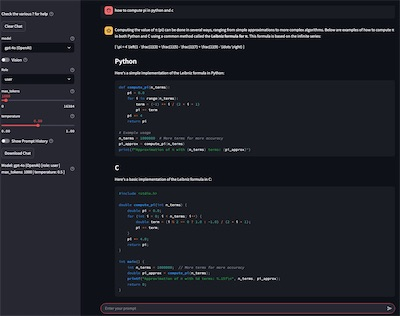
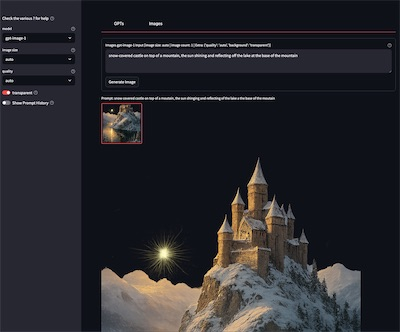

<h1>OpenAI API-compatible WebUI (OAIWUI)</h1>

Latest version: 0.9.12 (20250715)

- [1. Description](#1-description)
  - [1.1. Supported models](#11-supported-models)
  - [1.2. .env](#12-env)
  - [1.3. savedir](#13-savedir)
  - [1.4. password protecting the WebUI](#14-password-protecting-the-webui)
  - [1.5. Using "prompt presets" (GPT only)](#15-using-prompt-presets-gpt-only)
    - [1.5.1. prompt presets settings](#151-prompt-presets-settings)
- [2. Setup](#2-setup)
  - [2.1. Python uv](#21-python-uv)
  - [2.2. Docker/Podman](#22-dockerpodman)
    - [2.2.1. Building the container](#221-building-the-container)
    - [2.2.2. Running the container](#222-running-the-container)
    - [2.2.3. local build cleanup](#223-local-build-cleanup)
  - [2.3. Docker compose](#23-docker-compose)
  - [2.4. Unraid](#24-unraid)
- [3. Misc](#3-misc)
  - [3.1. Notes](#31-notes)
  - [3.2. Version information/Changelog](#32-version-informationchangelog)
  - [3.3. Acknowledgments](#33-acknowledgments)

Self-hosted WebUI ([streamlit](https://streamlit.io/)-based) to various GPT and Image generation APIs (requires valid API keys for each provider).

Supports some [OpenAI](https://platform.openai.com/docs/models_) API-compatible providers, such as [Perplexity AI](https://docs.perplexity.ai/models/model-cards_), [Gemini AI](https://ai.google.dev/gemini-api/docs/models), the self-hosted [Ollama](https://github.com/ollama/ollama) and [LiteLLM's Proxy Server](https://docs.litellm.ai/docs/#litellm-proxy-server-llm-gateway), enabling a company to install a self-hosted version of the WebUI to access the capabilities of various OpenAI API-compatible GPTs and Image generation APIs, then share access to the tool's capabilities while consolidating billing through API keys.

| GPT WebUI | Image WebUI |
| --- | --- |
| [](./assets/Screenshot-OAIWUI_WebUI_GPT.jpg) | [](./assets/Screenshot-OAIWUI_WebUI_Image.jpg) |


Check our [.env.example](./.env.example) for details of possible values for the environment variables. 
Unless otherwise specified, even if a feature is not used, its environment variable should be set.

A pre-built container is available from our Docker account at https://hub.docker.com/r/infotrend/openai_webui

An [Unraid](https://unraid.net/)-ready version is available directly from Unraid's `Community Applications`.

Note: this tool was initially developed in February 2023 and released to help end-users.

#  1. Description

The tool provides a WebUI to various GPT and Image generation APIs (requires valid API keys for each provider).

The tool **requires** the use of API keys to use commercial services.
Variables in the `.env` file have the list of possible values and links to additional information on how to get your API keys.

Depending on your deployment solution (*python virtualenv*, *docker image*, or *unraid*), the deployment might differ slightly.

Once started, the WebUI will prompt the end user with a `username`. 
This username is here to make finding past conversations/images easier if you seek those; no authentication is associated with it.

GPTs (Text Generation) sidebar options (see "?" mark for specific details):
- model: choose between the different GPT models that are enabled.
- role (user, system, assistant): define the role of the input text for tailored responses.
- max tokens: controls the length of generated text with a maximum token setting (dependent on the model)
- temperature: adjust the "surprisingness" of the generated text.
- additional features depend on the model, see the model information for details and various "?" marks for more details.

Image Generation sidebar options (see "?" for specific details):
- model: choose between the different Image models that are enabled.
- image Size: specify the dimensions of the images to be generated.
- additional features depend on the model, see the model information for details and various "?" marks for more details.

## 1.1. Supported models

Models are either `deprecated` or `active`.
- `deprecated` models are not available for use anymore.
- `active` models are known to the tool at the time of release.

The tool will automatically discard known (per the release) `deprecated` models and inform the end user. 
Please update your model selection accordingly.

The [models.json](./models.json) file contains the list of models supported by the current release.
The file content is computer-parsable yet human-readable, as such if you add a compatible model to the file, you should be able to use it right away.

The [models.md](./models.md) file shows the models supported by the current release.
This file can be generated using:
```bash
python3 ./list_models.py --markdown > models.md
```

Models are updated frequently by the providers, the list of models supported by the tool is updated at the time of release.
About model updates:
- If a model changes its name (for example with `preview` models), we will update the list of models supported by the tool at the next release.
- If a new model is added and not listed in the `models.json` file, please open an issue on GitHub. 
In both cases, if able to, please update the `models.json` file before opening an issue.

For additional details, see:
- OpenAI Models & API price: https://platform.openai.com/docs/models
  - To see the list of authorized models for your account, see https://platform.openai.com/settings/organization/limits
- Google Models & API price: https://ai.google.dev/gemini-api/docs/models
- Perplexity AI Models & API price: https://docs.perplexity.ai/guides/models
 
Self-hosted models:
- `ollama` is a self-hosted solution; the name is here for illustration prupose (`ollama` is not a recognized model value). At initialization, the tool will use the `OLLAMA_HOST` environment variable to attempt to find the server; then list and add all available hosted models. Capabilties of the hosted models are various: by default we will authorize `vision` and set a defauklt `max_tokens`; it is advised to check the model information for details on its actual capabilities. Find more information about [Ollama](https://github.com/oollama/ollama)
- `LiteLLM` is a Proxy Server to LLM APIs in OpenAI format. [`LiteLLM Proxy Server`](https://docs.litellm.ai/docs/#litellm-proxy-server-llm-gateway); will search for `LITELLM_URL` and `LITELLM_API_KEY` environment variable.

To obtain the list of Ollama or LiteLLM models enabled in your setup, you can run the following commands (requires `uv` to be installed and the `.env` file to be populated):
```bash
uv run ./list_models.py --ollama > ollama.md
uv run ./list_models.py --litellm > litellm.md
```

## 1.2. .env

**Do not distribute your `.env` file as it contains your API keys.**

The `.env.example` file contains the parameters needed to pass to the running tool.

Models:
- `OPENAI_API_KEY` (optional) as obtained from https://platform.openai.com/account/api-keys
- `PERPLEXITY_API_KEY` (optional) as obtained from https://docs.perplexity.ai/guides/getting-started
- `GEMINI_API_KEY` (optional) as obtained from https://ai.google.dev/gemini-api/docs/api-key
- `OLLAMA_HOST` (optional) for the URL to your Ollama server. All models found will be added to the list of available models.
- `LITELLM_URL` (optional) for the URL to your LiteLLM server. All models found will be added to the list of available models. If set the `LITELLM_API_KEY` is required for the API key to your LiteLLM server.

Configuration:
- `OAIWUI_SAVEDIR`, the location to save content (make sure the directory exists)
- `OAIWUI_GPT_ONLY`, to request only to show the GPT tab otherwise, shows both GPTs and Images (authorized value: `True` or `False`)
- `OAIWUI_GPT_MODELS` is a comma-separated list of GPT model(s) your API keys are authorized to use. For OpenAI, ee https://platform.openai.com/docs/api-reference/making-requests . For Perplexity AI, see https://docs.perplexity.ai/guides/pricing
- `OAIWUI_IMAGE_MODELS` is a comma-separated list of Image model(s) your API key is authorized to use.
- `OAIWUI_USERNAME` (optional) specifies a `username` and avoids being prompted at each re-run. The default mode is to run in multi-user settings so this is not enabled by default.
- `OAIWUI_GPT_VISION` will, for compatible models, disable their vision capabilities if set to `False`
- `OAIWUI_IGNORE_EMPTY` (required for Unraid) discard errors in case the following environment variables are used but not set.
- `OAIWUI_PROMPT_PRESETS_DIR` sets the directory that contains prompt presets. If a directory is provided, it must contains at least one valid json file.
- `OAIWUI_PROMPT_PRESETS_ONLY` sets the JSON file that contains valid settings to use for the `OAIWUI_PROMPT_PRESETS_DIR` presets.

Those values can be passed by making a `.env` file containing the expected values or using environment variables.

The `.env` file is not copied into the `docker` or `unraid` setup. Environment variables should be used in this case. 

The `models.txt` file is a environment variable ready version of the models list. It can be used for the `OAIWUI_GPT_MODELS` and `OAIWUI_IMAGE_MODELS` parameters.

It is possible to obtain that list from the `models.json` file as environment variables using the `list_models.py` script:
```bash
python3 ./list_models.py
```

## 1.3. savedir

The `OAIWUI_SAVEDIR` variable specifies the location where persistent files will be created from run to run.

Its structure is: `savedir`/`version`/`username`/`mode`/`UTCtime`/`<CONTENT>`, with:
- `username` being the self-specified user name prompted when starting the WebUI
- `version` the tool's version, making it easier to debug
- `mode` on of `gpt` or `image`
- the `UTCtime`, a `YYYYY-MM-DD T HH:MM:SS Z` UTC-time of the request (the directory's content will be time ordered)
- `<CONTENT>` is often a `json` file containing the details of the run for `gpt`, but also the different `png` images generated for `image`

We do not check the directories for size. It is left to the end user to clean up space if required.

## 1.4. password protecting the WebUI

To do this, create a `.streamlit/secrets.toml` file in the directory where the streamlit app is started (for the python virtualenv setup, this should be the directory where this `README.md` is present, while for other deployment methods, please see the corresponding [setup](#2-setup) section) and add a `password = "SET_YOUR_PASSWORD_HERE"` value to it.

When the WebUI starts, it will see of `secrets.toml` file and challenge users for the password set within.

## 1.5. Using "prompt presets" (GPT only)

Prompt presets enable the preparation of custom methods to answer "user" prompt by specifying some "system" and "assistant" settings.
It is used by setting the `OAIWUI_PROMPT_PRESETS_DIR` to a folder containg `.json` files.

We have provided an example directory containing one pre-configured "prompt preset".
The example directory is named `prompt_presets.example` and its content is the file `shakespeare.json` which guides the GPT answer in the English used by Shakespeare.

The structure of the used JSON file follows OpenAI `messages`' API structure and as such should be adhere to as closely as possible.
It contains a series of messages that will be passed at the begining of new conversations to the GPT to set the `role` to `system` (the direction the GPT is expected to follow when answering) and/or the `assistant` (past conversations/expected knowledge) for that GPT conversation. The `content` section is expected to be a `text` `type` with the `text` to provide to the GPT.

For example, one of the prompt for the `shakespeare.json` example is as follows:

```json
       {
            "role": "system",
            "content": [
                {
                        "type": "text",
                        "text": "You are a helpful assistant. You also like to speak in the words of Shakespeare. Incorporate that into your responses."
                }
            ],
            "oaiwui_skip": true
        }
```

The name of the prompt preset is directly related to the name of the file; if the file is title `shakespeare.json`, the prompt will be named `shakespeare`.

Creating new "prompt presets" should be a matter of duplicating the example and replacing the content within the file.

Another method consists of passing the prompt to the WebUI and setting the `role` accordingly, then running a query.
The content saved within the `savedir` will contain a `messages` structure that matches the `role` and `content` sections shown above. 
Integrate that content within a new prompt presets JSON file.

Note that the `oaiwui_skip` is not passed to the GPT, but is used to remove the content from the chat history.

**Note:** not all models will work with the prompt presets.

### 1.5.1. prompt presets settings

When using "prompt presets", it is possible to make the tool behave such that the end user can only use a single `model` with a set `temperature` and maximum requested `tokens`. This JSON settings file is used by pointing the `OAIWUI_PROMPT_PRESETS_ONLY` environment variable to the location of the file.

We have provided an example `prompt_presets_settings-example.json` file. This example file contains:

```json
{
    "model": "gpt-4o-mini",
    "tokens": 3000,
    "temperature": 0.5
}
```
, which will:
- use the `gpt-4o-mini` model (which must be in the `OAIWUI_GPT_MODELS` list of authorized models)
- requests a maximum of 3K tokens for the GPT answer. The maximum value per model differs so the tool will error if the requested value is too high (note this is not the context tokens, which covers the entire chat)
- set the temperature to 0.5. The temperature controls the randomness of responses, with lower values yielding more deterministic answers and higher values producing more creative and varied outputs (the range is 0 to 1)

**Note:** not all parameters will work with the different models.

#  2. Setup

## 2.1. Python uv

We are now using `uv` to run the WebUI.

For more details on the tool and how to install it, see https://docs.astral.sh/uv/ and https://github.com/astral-sh/uv

The following sections expect the `uv` command to be available.

Dependencies are defined in the `pyproject.toml` file. 
Because we are using `uv`, no "local to the project" virtual environment is used.

Copy the default `.env.example` file as `.env`, and manually edit the copy to add your API keys and the preferred save directory (which must exist before starting the program). 
You can also configure the GPT amd Image generation `models` you can access 

   ```bash
   $ cp .env.example .env
   $ vi .env
   ```

```bash
uv tool run --with-requirements pyproject.toml streamlit run ./OAIWUI_WebUI.py --server.port=8501 --server.address=0.0.0.0 --server.headless=true --server.fileWatcherType=none --browser.gatherUsageStats=False --logger.level=info
```

You can now open your browser to http://127.0.0.1:8501 to test the WebUI.

The above command is also available as:

```bash
make uv_run
```

## 2.2. Docker/Podman

Using containers is an excellent way to test the tool in an isolated, easily redeployed environment.

The container provides two extra environment variables: `WANTED_UID` and `WANTED_GID`. Through their use, it is possible to set the user ID and group ID of the internal `oaiwui` user. The container is not running as `root`. This user will write files to the mounted volumes; which allows to set the ownership of the files to the user and group ID of the host. If none are specified on the command line, the default values of `0` and `0` are used (ie the `root` user).

This setup prefers the use of environment variable, using `docker run ... -e VAR=val`, but it is also possible to use a `.env` file or  `/oaiwui_config.sh` file mounted within the container, as described below.

Different options are available using the `Makefile`; type `make` to see the up-to-date list of options.

### 2.2.1. Building the container

The `Makefile` provide an easy means to build the container:

```bash
make build
```

This will create a local container named `openai_webui` with two `tags`: the current version number (as defined in the `Makefile`) and the `latest` tag.

An already built container is provided by on DockerHub: `infotrend/openai_webui`.

### 2.2.2. Running the container

The following uses the `infotrend/openai_webui` container, adapt if you have built your own container.

Paths that are specified as environment variables are expected to be mounted from the host to the container: when setting `OAIWUI_SAVEDIR=/iti`, the container's `savedir` should be mounted from the host to `/iti` using `-v /host/savedir:/iti` `docker run` argument.

There are multiple options to run the container. The following are examples commands, adapt as needed.

Use environment variables on the command line to setup the most common options found in the `.env` file:
  ```bash
  docker run --rm -it -p 8501:8501 -v `pwd`/savedir`:/iti -e OAIWUI_SAVEDIR=/iti -e WANTED_UID=`id -u` -e WANTED_GID=`id -g` -e OPENAI_API_KEY="Your_OpenAI_API_Key" -e OAIWUI_GPT_ONLY=False -e OAIWUI_GPT_MODELS="gpt-4o-mini,gpt-4.1" -e OAIWUI_IMAGE_MODELS="dall-e-3" infotrend/openai_webui:latest
  ```

To use the "prompt presets" and its "prompt presets settings" environment variables, those can be added to the command line. For example to use the provided examples add the following to the command line (before the name of the container): 
```-v `pwd`/prompt_presets.example:/prompt_presets -e OAIWUI_PROMPT_PRESETS_DIR=/prompt_presets```
and  ```-v `pwd`/prompt_presets_settings-example.json:/prompt_presets.json -e OAIWUI_PROMPT_PRESETS_ONLY=/prompt_presets.json```

To use the password protection for the WebUI, create and populate the `.streamlit/secrets.toml` file before you start the container (see [password protecting the webui](#14-password-protecting-the-webui)) then add `-v PATH_TO/secrets.toml:/app/.streamlit/secrets.toml:ro` to your command line (adapting `PATH_TO` with the full path location of the secrets file)

With the above options enabled, the earlier command line would become:
  ```bash
  docker run --rm -it -p 8501:8501 -v `pwd`/savedir:/iti -e OAIWUI_SAVEDIR=/iti -e WANTED_UID=`id -u` -e WANTED_GID=`id -g` -e OPENAI_API_KEY="Your_OpenAI_API_Key" -e OAIWUI_GPT_ONLY=False -e OAIWUI_GPT_MODELS="gpt-4o-mini,gpt-4.1" -e OAIWUI_IMAGE_MODELS="dall-e-3" -v `pwd`/prompt_presets.example:/prompt_presets:ro -e OAIWUI_PROMPT_PRESETS_DIR=/prompt_presets -v `pwd`/prompt_presets_settings-example.json:/prompt_presets.json:ro -e OAIWUI_PROMPT_PRESETS_ONLY=/prompt_presets.json -v `pwd`/secrets.toml:/app/.streamlit/secrets.toml:ro infotrend/openai_webui:latest
  ```

It is possible to specify some of the command line options from a file mounted within the container.

One such method is to use a `.env` file mounted within the `/app` directory. 
Mounts still need to be performed: adapt the provided `.env.example` file and uses `/iti` for its `OAIWUI_SAVEDIR` environment variable. Extend/adapt the remaining environment variables as needed. Without the prompt presets and password protection options, the command line can be simplified as:
  ```bash
  docker run --rm -it -p 8501:8501 -v `pwd`/savedir:/iti -e OAIWUI_SAVEDIR=/iti -e WANTED_UID=`id -u` -e WANTED_GID=`id -g` -v `pwd`/.env.docker.example:/app/.env:ro infotrend/openai_webui:latest
  ```

Another alternative is to use a `config.sh` file mounted within the container as `/oaiwui_config.sh`. The `WANTED_UID` and `WANTED_GID` environment variables can be set within the file. To have a more complete conguration in a file, the example `config.sh` file, can be mounted within the container as `/oaiwui_config.sh`.
  ```bash
  docker run --rm -it -p 8501:8501 -v `pwd`/savedir:/iti -v `pwd`/config.sh:/oaiwui_config.sh:ro infotrend/openai_webui:latest
  ```

### 2.2.3. local build cleanup

Use the `Makefile` to delete locally built containers:
  ```bash
  $ make delete
  ```

Container are built using `buildx`. To delete the build context, use:
  ```bash
  $ make buildx_rm
  ```

## 2.3. Docker compose

To run the built or downloaded container using `docker compose`, decide on the directory where you want the `compose.yaml` to be. In this example, files are relative to the path where the `compose.yaml` file is located. Create the `savedir` directory and if using `WANTED_UID` and `WANTED_GID`, make sure that folder is owned by the user and group ID specified.

Adapt the following example to your needs and save it as `compose.yaml`:
  ```yaml
  services:
    openai_webui:
      image: infotrend/openai_webui:latest
      container_name: openai_webui
      restart: unless-stopped
      volumes:
        - ./savedir:/iti
        # Warning: do not mount other content within /iti 
        # Uncomment the following and create a secrets.toml in the directory where this compose.yaml file is to password protect access to the application
        # - ./secrets.toml:/app/.streamlit/secrets.toml:ro
        # Mount your "prompt presets" directory to enable those are options
        # - ./prompt_presets.example:/prompt_presets:ro
        # Mount the "prompt presets" settings file to limit users to the model, tokens and temperature set in the file
        # - ./prompt_presets_settings-example.json:prompt_presets.json:ro
        # Mount your config file to preset environment variables if preferred; delete corresponding entries from the environment section
        # - ./config.sh:/oaiwui_config.sh:ro
      ports:
        # host port:container port
        - 8501:8501
      environment:
        - OPENAI_API_KEY=${OPENAI_API_KEY}
        # Add as many API keys as needed, see the .env example for more details
        - OAIWUI_SAVEDIR=/iti
        # Uncomment and Set the user ID and group ID of the `oaiwui` user and group. If none are specified, 0/0 will be used
        # - WANTED_UID=1001
        # - WANTED_GID=1001
        # Adapt the following as best suits your deployment
        - OAIWUI_GPT_ONLY=False
        - OAIWUI_GPT_MODELS=gpt-4o
        - OAIWUI_GPT_VISION=True
        # Even if OAIWUI_GPT_ONLY is True, please set a model, it will be ignored
        - OAIWUI_IMAGE_MODELS=dall-e-3
        # Uncomment and enter a value if you are using a single user deployment
        # - OAIWUI_USERNAME=user
        # Enable the user of "prompt presets" present in the mounted directory (must have a directory matching in the `volumes` section)
        # - OAIWUI_PROMPT_PRESETS_DIR=/prompt_presets
        # Enable the "prompt presets" setting (must have a file matching in the `volumes` section)
        # - OAIWUI_PROMPT_PRESETS_ONLY=/prompt_presets.json
  ```

Such that:
- Add other variables as needed from your [.env](.env.example) or [config.sh](config.sh) files.
- Create a  `docker compose` specific`.env` file in the same directory as the `compose.yaml` file: it needs only contain the `OPENAI_API_KEY=value` entry or other API keys as needed, such that those private values are not exposed in the `compose.yaml` file. 
- If using `WANTED_UID` and `WANTED_GID`, make sure that folder is owned by the user and group ID specified.
- If using a `secrets.toml` file with a `password=WEBUIPASSWORD` content, or other environment variables, uncomment/add the corresponding entry in the `compose.yaml` file.

As configured, the container will `restart` `unless-stopped` which also means that unless the container is stopped it will automatically restart after a host reboot.

Run using:
  ```bash
  docker compose up -d
  ```

The WebUI will be accessible on port 8501 of your host.

## 2.4. Unraid

For [Unraid](https://unraid.net/) users, the same container can be used with unraid's preferred `uid`/`gid`. To do so, specify the `WANTED_UID` and `WANTED_GID` environment variables in the container's template.

The pre-built container has been added to Unraid's Community Applications.

The configuration file contains many of the possible environment variables, as detailed in the [.env](#12-env) section.

Omitted from the configuration file are mounted volumes. If needed, a `Path` mapping a `secrets.toml` file to the `/app/.streamlit/secrets.toml` location within the running docker container (read-only recommended). 
Before setting this, create and populate a file with the expected value (as described in [password protecting the WebUI](#14-password-protecting-the-webui)).
For example, if your `appdata` location for the OpenAI WebUI was `/mnt/user/appdata/openai_webui` in which you placed the needed `secrets.toml` file, the expected XML addition would look similar to: 
  ```xml
  <Config Name="/app/.streamlit/secrets.toml" Target="/app/.streamlit/secrets.toml" Default="/mnt/user/appdata/openai_webui/secrets.toml" Mode="ro" Description="WebUI password protection -- secrets.toml file must exist with a password variable" Type="Path" Display="always" Required="false" Mask="false">/mnt/user/appdata/openai_webui/secrets.toml</Config>
  ```

# 3. Misc

##  3.1. Notes

- If you run into an error when starting the tool. Clear the `streamlit` cache (right side menu) or deleting cookies should solve this.

##  3.2. Version information/Changelog

- v0.9.12 (20250715): Added LiteLLM support (including compatible providers such as OpenRouter.ai) + updated openai python package to 1.96.0
- v0.9.11 (20250513): Using chat interface for GPTs, and support for additional OpenAI API-compatible providers (Perplexity AI, Gemini AI and the self-hosted Ollama) + new image generation model + moved to uv for deployment + Changed base container to ubuntu:24.04 and added WANTED_UID and WANTED_GID environment variables for Docker and Unraid
- v0.9.10 (20241217): Added `o1` model (untested) following its API access availability
- v0.9.9 (20241206): API changes to use `o1-mini` and `o1-preview` (tested)
- v0.9.8 (20241010): Added `o1-preview` and `o1-mini` model (untested) + "prompt presets" functionalities 
- v0.9.7 (20240718): Added `gpt-4o-mini` and `deprecated` older `32k` models
- v0.9.6 (20240701): Added method to disable `vision` for capable models + added whole WebUI password protection using streamlit's `secrets.toml` method 
- v0.9.5 (20240611): Added support for `vision` in capable models + Added `gpt-4-turbo` models + Deprecated some models in advance of 20240613 + Updated openai python package to 1.33.0 + Decoupled UI code to allow support for different frontends.
- v0.9.4 (20240513): Added support for `gpt-4o`, updated openai python package to 1.29.0
- v0.9.3 (20240306): Simplifying integration of new models and handling/presentation of their status (active, legacy, deprecated) + Cleaner handling of max_tokens vs context window tokens + updated openai python package to 1.13.3
- v0.9.2 (20241218): Keep prompt history for a given session + allow user to review/delete past prompts + updated openai python package: 1.8.0
- v0.9.1 (20231120): Print `streamlit` errors in case of errors with environment variables + Addition of `gpt-3.5-turbo-1106` in the list of supported models (added in openai python package 1.3.0) + added optional `OAIWUI_USERNAME` environment variable
- v0.9.0 (20231108): Initial release -- incorporating modifications brought by the latest OpenAI Python package (tested against 1.2.0)
- Oct 2023: Preparation for public release
- Feb 2023: Initial version
  
## 3.3. Acknowledgments

This project includes contributions from [Yan Ding](https://www.linkedin.com/in/yan-ding-01a429108/) and [Muhammed Virk](https://www.linkedin.com/in/mhmmdvirk/) in March 2023.

